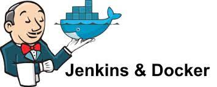
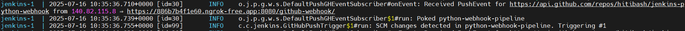
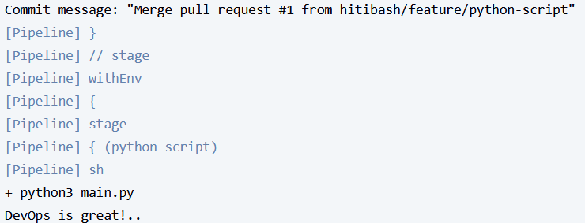

# Jenkins Webhook Demo



## Project Overview

This project demonstrates a minimal CI/CD setup using Jenkins and Docker that triggers a pipeline whenever a GitHub **pull request is merged** into the `main` branch. The setup is designed to be easy to run, clean, and educational.

---

## Features

- Jenkins runs in Docker with pre-installed plugins for Git and GitHub integration.
- Automatically creates a pipeline job on startup.
- Runs a sample Python script as a build step.
- Skips the Jenkins setup wizard and creates a default admin user.
- Persistent Jenkins home volume for data storage.

## Prerequisites

- [Docker](https://www.docker.com/get-started)
- [Docker Compose](https://docs.docker.com/compose/)
- GitHub repository (for webhook integration)

## Getting Started

1. **Clone this repository:**
   ```sh
   git clone https://github.com/hitibash/jenkins-python-webhook.git
   cd jenkins-python-webhook
   ```

2. **Build and start Jenkins using Docker Compose:**
   ```sh
   docker-compose up --build
   ```

3. **Access Jenkins:**
   - Open [http://localhost:8080](http://localhost:8080) in your browser.
   - Login with username: `admin`, password: `admin`

4. **Expose Jenkins to GitHub (for webhook delivery):**

   If running Jenkins locally, you need to expose your local server to the internet so GitHub can reach it. You can use either **ngrok** or **smee.io**:

   - **Using ngrok:**
     1. [Download ngrok](https://ngrok.com/download) and install it.
     2. Run the following command to forward port 8080:
        ```sh
        ngrok http 8080
        ```
     3. Copy the generated `https://xxxx.ngrok.io` URL.

   - **Using smee.io:**
     1. Go to [https://smee.io](https://smee.io/) and click "Start a new channel".
     2. Copy the generated smee URL (e.g., `https://smee.io/your-channel-id`).
     3. Install smee-client:
        ```sh
        npm install --global smee-client
        ```
     4. Forward events to your local Jenkins:
        ```sh
        smee -u https://smee.io/your-channel-id --target http://localhost:8080/github-webhook/
        ```

5. **Configure GitHub Webhook:**
   - Go to your GitHub repository settings.
   - Add a webhook pointing to your public URL (from ngrok or smee.io), e.g., `https://xxxx.ngrok.io/github-webhook/` or your smee channel.
   - Set content type to `application/json`.
   - Choose "Let me select individual events" and select "Pull request".

6. **Test the Pipeline:**
   - Merge a pull request into the `main` branch of your repository.
   - The Jenkins pipeline should trigger and run the sample Python script.

## File Structure

- `dockerfile` - Jenkins Docker image with Python and plugins.
- `docker-compose.yml` - Docker Compose configuration.
- `plugins.txt` - Jenkins plugins to install.
- `scripts/disable_wizard.groovy` - Disables Jenkins setup wizard and creates admin user.
- `scripts/pipeline.groovy` - Automatically creates the pipeline job.
- `Jenkinsfile` - Pipeline definition.
- `main.py` - Sample Python script.

## Customization

- Edit `main.py` to change the script executed by the pipeline.
- Modify `Jenkinsfile` to add more build/test/deploy stages.
- Update `scripts/pipeline.groovy` to change job configuration.

## Example Output

### Jenkins Container Logs

To view Jenkins container logs, run:
```sh
docker compose logs jenkins
```



### Pipeline Output

Open the job's "Console Output" in Jenkins to see the Python script executed by the pipeline:



## Troubleshooting

- Ensure Docker and Docker Compose are installed and running.
- If Jenkins plugins fail to install, try rebuilding the image.
- For webhook issues, verify your Jenkins server is accessible from GitHub.
- Make sure your ngrok tunnel or smee.io forwarding service is running and actively forwarding requests to your local Jenkins instance.


